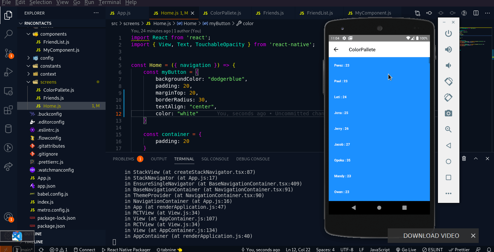

# ColorList

This is a small app I build while learning the basics of React Native

## The concepts I learned and put to work

- How to Install And set up React Native
- How to create components
- State and Props
- Navigation
- Forms
- Making Network Requests

## A Simple Demonstration

